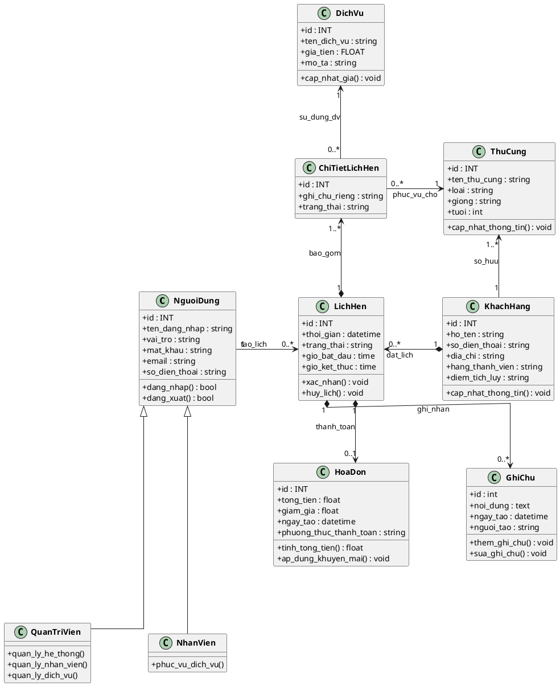

# Sơ đồ Class Hệ thống Quản lý Cửa hàng Thú cưng

Sơ đồ dưới đây mô tả cấu trúc các lớp (Class) và mối quan hệ giữa chúng trong hệ thống Pet Shop Management. Đặc biệt, logic liên kết giữa **Dịch vụ** và **Thú cưng** đã được xử lý thông qua bảng trung gian **Chi tiết lịch hẹn** để đảm bảo một lịch hẹn có thể đăng ký nhiều dịch vụ cho nhiều thú cưng khác nhau.

## Giải thích phần logic Bảng trung gian (Chi tiết lịch hẹn):

1. **Vấn đề trước đây:** Nếu Lịch hẹn kết nối trực tiếp với Thú cưng và Dịch vụ, hệ thống sẽ gặp khó khăn khi 1 khách hàng mang 2 con chó đến: một con cắt tỉa lông, một con tắm. Lịch hẹn không thể phân định rõ Dịch vụ nào áp dụng cho Thú cưng nào.
2. **Giải pháp Bảng trung gian (`ChiTietLichHen`):**
   - Lớp `ChiTietLichHen` nằm giữa và chia nhỏ `LichHen` thành nhiều dòng chi tiết.
   - **Mỗi chi tiết sẽ chỉ định rõ:** Đăng ký 1 `DichVu` cho 1 `ThuCung` cụ thể.
   - Nhờ đó, logic Lịch hẹn trở nên mềm dẻo, đáp ứng được mọi tình huống thực tế của phòng khám/spa thú cưng mà vẫn giữ được độ liên kết chặt chẽ (Clean Architecture).
   - `KhachHang` vẫn đóng vai trò trung tâm tạo ra `LichHen` và quản lý `ThuCung`.

