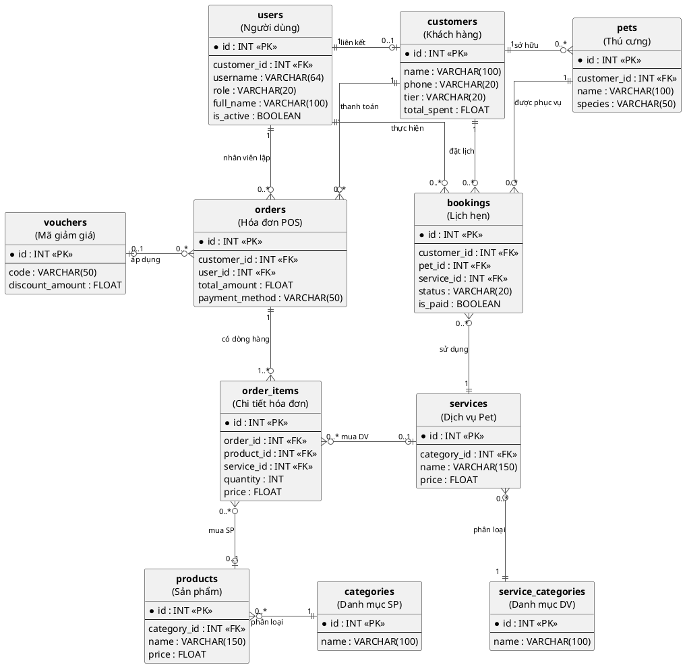

# Sơ đồ Thực thể Mối quan hệ (ERD) - Pet Shop Management

Sơ đồ dưới đây mô tả cấu trúc cơ sở dữ liệu của hệ thống, bao gồm các bảng, các trường thông tin và mối liên kết giữa chúng. Cấu trúc đã được làm sạch và sắp xếp logic theo luồng chức năng.

## Giải thích các bảng chính:

1.  **users**: Lưu trữ thông tin tài khoản đăng nhập và phân quyền (Admin, Nhân viên, Khách).
2.  **customers & pets**: Quản lý thông tin chủ sở hữu và thú cưng. Có mối quan hệ 1-nhiều.
3.  **products & services**: Danh mục các mặt hàng và dịch vụ mà cửa hàng cung cấp.
4.  **bookings**: Quản lý lịch hẹn chăm sóc thú cưng, kết nối khách hàng, thú cưng và dịch vụ.
5.  **orders & order_items**: Lưu trữ lịch sử giao dịch bán hàng và sử dụng dịch vụ tại quầy (POS).

